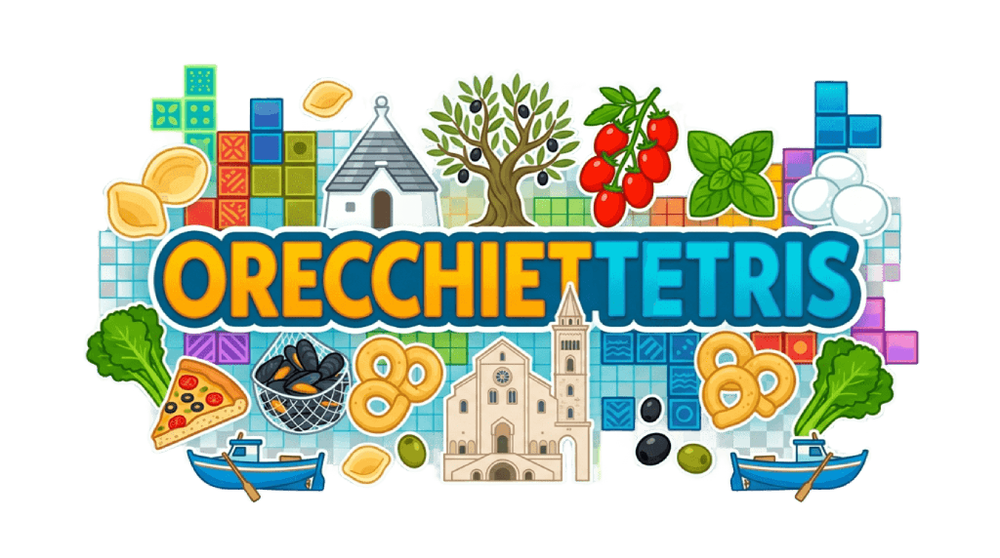

# OrecchietTetris

### Authors

- [Colonna Mariagrazia](mailto:mariagrazia.colonna@studio.unibo.it)
- [De Cillis Mirko](mailto:mirko.decillis@studio.unibo.it)
- [Pennisi Lorenza](mailto:lorenza.pennisi@studio.unibo.it)

## Abstract
"OrecchietTetris" is a logic and reasoning, single-player game, where the player has to fit together blocks of different shapes that fall from above, called tetrominoes, each represented by a typical Apulian food. The aim is to complete horizontal lines: once a line is completed, it disappears, moving the others down, and this allows the player to gain points and climb the rankings.
The game features an Apulian style, with visual elements that remind the rejon and a soundtrack that includes songs by some of the most renowned artists from Apulia. It also includes a local high-score leaderboard and a language selection.
This project, developed for the Software Engineering course of the DTM master's degree at Unibo, implements the MVC architectural pattern, incorporating the observer-subscriber design pattern to ensure the decoupling between model and view.
Automated workflows enforce Git Flow and Semantic Release consistency.

## Disclaimer (if needed)

During the preparation of this work, Claude Code was used to assist with the implementation of the software, while all design decisions were made by the authors. Its involvement is fully traceable in the Git history, where it is listed as a co-author of the relevant commits.
After using this tool, the authors reviewed and edited the content as needed and take full responsibility for the content of the final report/artifact.

