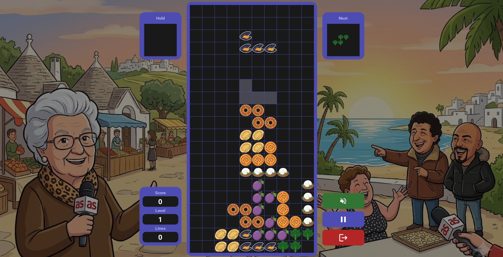

# Concept

OrecchietTetris is a desktop application with a GUI. It is a Tetris-inspired game featuring visual and audio elements inspired by Apulian culture.



The game is distributed as a Python package via PyPI and installable with a single pip install command:
```bash
pip install OrecchietTetris
```
Once installed, the user launches the game locally on their machine, without the need of network connection or backend service required. The GUI is built with Kivy, making it cross-platform across Windows, macOS, and Linux.

Therefore, the users are players that can move, rotate, hard drop and swap pieces to complete lines in a 10x20 grid. 
Players earn points by clearing lines. A line is cleared when it is completely filled with blocks (i.e. it does not contains empty spaces), causing it to disappear and award points.

The game ends when new tetrominoes can no longer be placed on the grid because the stacked pieces have reached the top of the playing area.
Scores are saved by the system in the user file system and displays them in the leaderboard. 
During the game session, the player can listen to an integrated soundtrack, adjust or toggle the volume, and skip songs.

The software is intended for casual use. Users typically interact with it during their free time or short breaks for entertainment purposes. The game also appeals to players who want to immerse themselves in an authentic Apulian experience, while playing the evergreen game of Tetris.
The frequency of use is not fixed and varies among users, ranging from sporadic play sessions to regular daily use.
