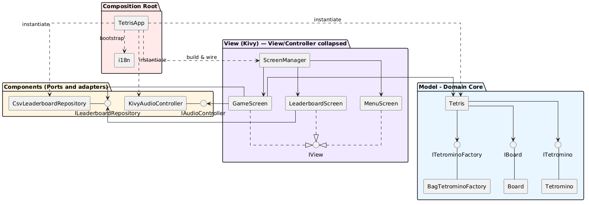
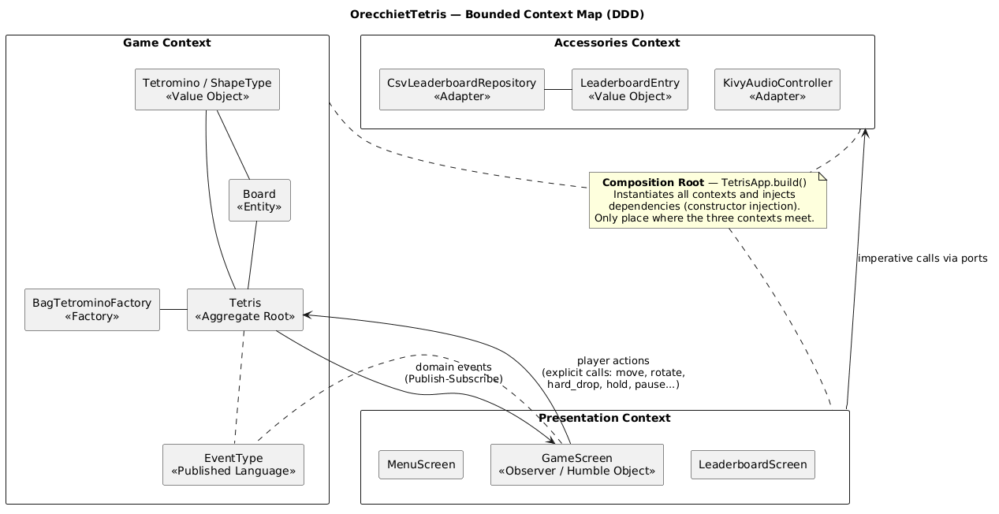
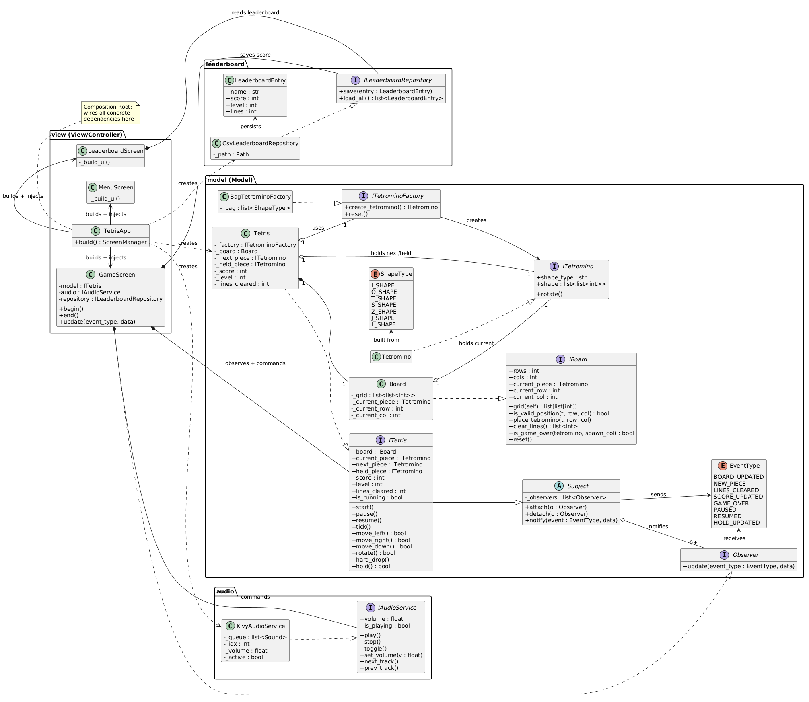
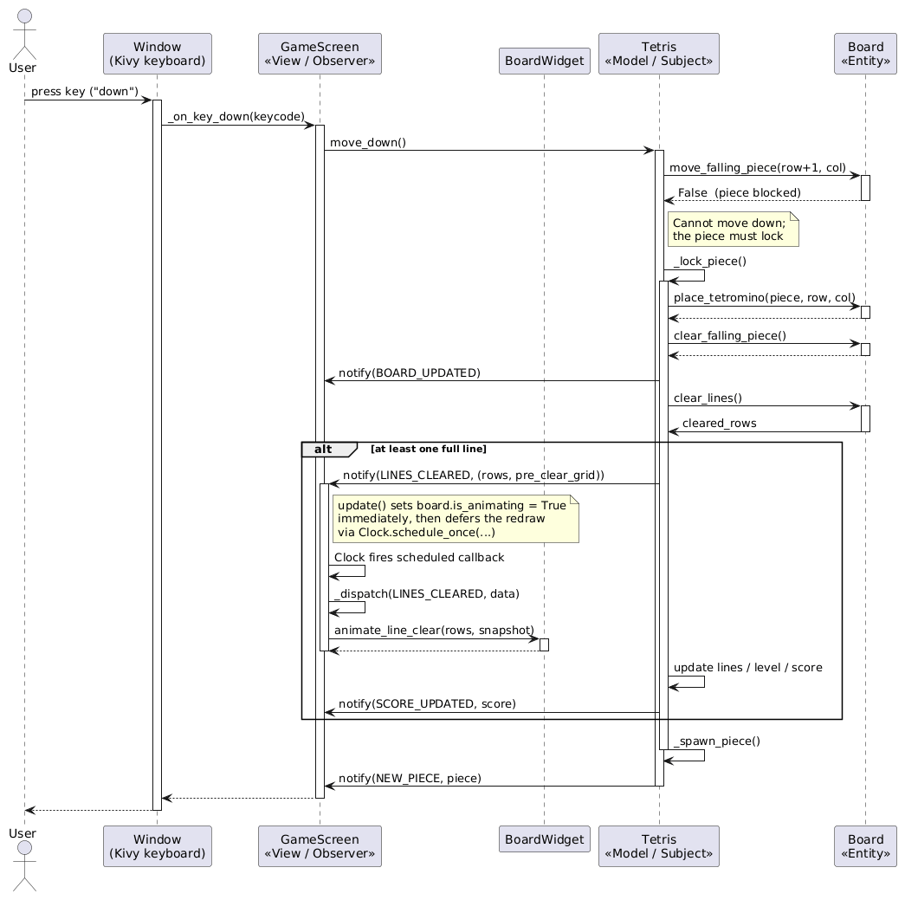
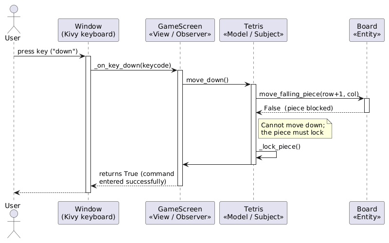
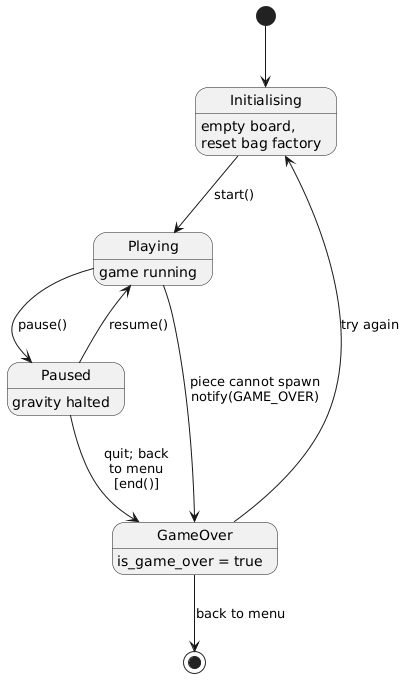

# Design

## Table of Contents

1. [Architecture](#architecture)
   1. [Architectural Style](#architectural-style)
   2. [Detailed Architecture](#detailed-architecture)
   3. [System Components](#system-components)

2. [Infrastructure](#infrastructure)

3. [Modelling](#modelling)
   1. [Domain driven design (DDD) modelling](#domain-driven-design-ddd-modelling)
   2. [Object-oriented modelling](#object-oriented-modelling)

4. [Interaction](#interaction)
   1. [Component Interaction](#component-interaction)
   2. [Component Interaction Patterns](#component-interaction-patterns)
   3. [Interaction Example](#interaction-example)

5. [Behaviour](#behaviour)

6. [Data Persistence](#data-persistence)

---

## Architecture

### Architectural Style

The architecture chosen for the system is object-based, organized in layers and following the MVC pattern. The object-based style is the main one: the system is decomposed into objects that collaborate and expose their behaviour through interfaces, and the dependencies are expressed against abstractions rather than concrete classes.

> The definition of the interfaces also makes it possible to change the actual implementation of the classes without affecting the rest of the system. For example, it is possible to define another class `SqlLeaderboardRepository`, implementing `ILeaderboardRepository`, that interacts with a leaderboard table stored in a SQL database. Such implementation can be integrated in the system by changing the instantiation of the leaderboard repository in `app.py`.

Communication among the components occurs in two different ways, depending on its direction:

- from Model to View, the communication is event-based and follows the Observer pattern (also known as Publish-Subscribe): the Model emits a typed event (`EventType`) through its `Subject` interface and notifies its observers, without holding any reference to them; the View, registered as an observer, handles each event on its own and updates the UI accordingly;
- from View to Model, the communication is object-based, through explicit (synchronous) invocation of the Model's methods (e.g. `move_left`, `rotate`, `hold`) in response to user input.

This hybrid scheme keeps the dependency one-directional: the View depends on the Model, never the opposite. The event channel inverts the flow of control without inverting the dependency, so cyclic dependencies are avoided and the Model remains free of any UI or framework concern, and can therefore be tested independently.

> Why not the other styles?
>
> - Shared dataspace: the application is a single process with a single writer (the Model) and one consumer (the View). A shared mutable store would add coordination overhead and weaken the separation between Model and View, without any real advantage in a system of this size.
> - A purely event-based style (i.e. a global event bus for every interaction): user actions on the Model are inherently synchronous operations that often need an immediate return value (e.g. whether a move succeeded). Modeling them as events would add indirection and make the control flow harder to follow, while only the Model-to-View direction really benefits from the decoupling.
> - A purely layered style alone is not sufficient: strict layering implies top-down synchronous calls only, and this would force either the View to poll the Model or the Model to call back into the View (creating a dependency cycle). Layering is therefore kept as the structural organization, but combined with the event-based channel that removes that coupling.

### Detailed Architecture

The architecture adopted is a layered MVC core combined with a Ports-and-Adapters organization (a lightweight form of the Hexagonal architecture). The domain logic (the Model: `Tetris`, `Board`, `Tetromino`) forms an inner core that depends on nothing outside itself and is completely free of any UI or framework concern. Around it, a set of ports (the interfaces `ILeaderboardRepository`, `IAudioService`, `ITetrominoFactory` and `IView`) defines the boundaries through which the core interacts with the outside world, while their concrete implementations act as interchangeable adapters.

> A full Hexagonal architecture, with a dedicated application-service layer mediating every interaction, would introduce a level of complexity that is not justified by the size of the system.

The architecture relies on the Dependency Inversion principle: the dependency rule always points inward, so both the high-level components (the Model, the View) and the low-level ones (persistence, audio, piece generation) depend on the abstractions defined by the core, never on each other's concrete classes. All the dependencies are defined in the `TetrisApp.build()` composition root, which instantiates the concrete classes and injects them into each component.



### System Components

#### Leaderboard Repository

Leaderboard persistence is hidden behind the `ILeaderboardRepository` port, applying the Repository pattern. The default adapter, `CsvLeaderboardRepository`, stores and loads score entries (`LeaderboardEntry`) in a local CSV file. Since the rest of the system depends only on the interface, this adapter can be replaced (e.g. by a `SqlLeaderboardRepository` backed by a database) without touching the Model or the View.

#### Audio Service

Music playback is hidden behind the `IAudioService` port. The default adapter, `KivyAudioService`, wraps the Kivy audio facilities to provide play/pause, track navigation and volume setting.

#### Tetromino Factory

The generation of the falling pieces is delegated to the `ITetrominoFactory` port, applying the Factory pattern. The default adapter, `BagTetrominoFactory`, implements the classic 7-bag randomizer: it draws the seven shapes in a shuffled order and refills the bag once it is empty, guaranteeing a fair distribution. The `Tetris` model depends only on the `ITetrominoFactory` abstraction and receives the factory through its constructor (falling back to the bag factory when none is supplied), so an alternative generation strategy (for instance a fully random one, or a deterministic factory for testing) can be substituted without changing the game logic.

#### Logic Layer (Model)

The core game logic lives in the Model, whose central component is the `Tetris` class. It is the aggregate root of the game: it owns the `Board`, the current, next and held pieces, and the whole progression state (score, level, lines cleared) together with the runtime game flags. All the rules of Tetris are concentrated here: piece movement and rotation with wall-kicks, the shadow (landing) projection, locking, line detection and clearing, scoring, level progression and the hold mechanic. All the game operations are exposed as explicit methods, such as the player actions (`move_left`, `move_right`, `move_down`, `rotate`, `hard_drop`, `hold`) and the game-flow operations (`start`, `pause`, `resume`, `tick`). The Model is the single source of truth: it alone decides whether a move is legal and mutates the game state accordingly.

An important point is that `Tetris` is not concerned with the upper layer (i.e. the View). It communicates outward only by playing the role of Subject in the Observer pattern, emitting `EventType` events whenever its state changes. Piece generation is delegated to an injected `ITetrominoFactory`, keeping even the randomization strategy outside the core rules. This framework-free design makes the Logic Layer fully testable in isolation and keeps the dependency one-directional: the View calls into the Model, while the Model answers back only through events.

#### Presentation Layer (View)

The presentation side of the system is built with the Kivy framework. The View is decomposed hierarchically. At the top level, each page of the application is a screen (`MenuScreen`, `GameScreen` and `LeaderboardScreen`), managed by a Kivy `ScreenManager` that owns the transitions between them. All screens implement the common `IView` port (`show`, `hide`), so the application root can drive their lifecycle in a uniform way. Each screen is in turn composed of smaller, reusable widgets collected in the `view/widgets` package. Such widgets only know how to render themselves and expose simple setters. This composition keeps the UI modular: a component such as `PiecePreview` is reused for both the *next* and the *hold* boxes, and the rendering of a single block is centralized in the `BlockRenderer`.

In the classic separation, the Controller is a distinct component; here, instead, the controller responsibilities are embedded in the screen classes themselves, so View and Controller are effectively collapsed into the same objects. `GameScreen`, for example, both renders the game and captures the user input, translates it into Model actions, and drives the gravity timer. This choice is a natural consequence of the Kivy programming model: the object that owns the on-screen focus is also the one that receives the input events, so a standalone Controller would only mean routing every event out of the widget that already owns it and back again, without a real benefit. The only controller logic kept outside the screens concerns the screen transitions and the object wiring, which live in `TetrisApp`.

Keyboard input is handled entirely inside `GameScreen`. When the screen is shown, it requests the keyboard from the Kivy `Window` (`Window.request_keyboard`) and binds `on_key_down`; when hidden, it unbinds and releases the keyboard so no other screen receives unwanted input. The handler `_on_key_down` maps each key to an explicit Model method and dispatches the UI-only concerns (pause, quit confirmation, music toggle, track change) locally. It contains no game logic itself: the Model decides whether a move is legal and, in turn, notifies the View through events. This preserves the one-directional dependency described earlier: the View calls into the Model, the Model answers back only via Observer events.

> Kivy was chosen over the alternatives considered (Tkinter, Pygame) for reasons detailed in the [Development](../04-development/) chapter.

#### Composition Root

Object wiring follows constructor injection with a single composition root, located in `TetrisApp.build()` (`app.py`). This is the only place that selects the concrete adapters and assembles the object graph: it instantiates the `Tetris` model, the `CsvLeaderboardRepository` and the `KivyAudioService`, then injects them into the screens that need them. The same composition root also bootstraps the internationalization component (`i18n`): it configures the translation backend (locale, fallback language and the path of the `en`/`it` translation files) once at startup, so the View layer can resolve the localized strings through `i18n.t(...)` without any component having to know how or where the translations are loaded. As a result, replacing an adapter or changing the active language requires changes only in the composition root, and every component can be tested in isolation by injecting test doubles in place of the real implementations.

## Infrastructure

OrecchietTetris is a standalone desktop application that runs entirely on the end user's machine, and all of its parts live inside one Python process. Consequently, the typical infrastructural concerns of a distributed system do not apply to this project: persistence is limited to a single local CSV file, and there is no network distribution, since every component is located on the same machine. Because all the collaborators are ordinary objects wired together at startup, no naming, DNS, service discovery or load-balancing infrastructure is needed. Components "find" each other through dependency injection at the composition root: each object receives the references to its collaborators directly through its constructor.

## Modelling

### Domain driven design (DDD) modelling

The domain of OrecchietTetris can be partitioned into three bounded contexts, each one mapped onto a distinct area of the source tree and each one owning its own model and its own responsibilities. The three contexts communicate only through explicit interfaces and, in the case of the game logic, through domain events.



#### Game Context (`model` package)

This is the core domain of the system: it contains the rules of Tetris and all the state that describes the game in progress. Everything else in the application exists only to serve this context.

##### Game Context Concepts

- The `Tetris` class is the aggregate root of the context. It is the single entry point through which the rest of the system interacts with the game: it exposes the player actions, the game-flow actions and a set of read-only properties (score, level, lines cleared, running/paused/game-over flags). It guarantees the invariants of the game (no piece may occupy an invalid position, the hold slot may be used only once per piece, the level increases every ten cleared lines) and it protects the internal objects it owns from external mutation.
- The `Board` is the mutable grid that keeps track of the placed cells and of the currently falling piece. It is owned by the `Tetris` aggregate and is never exposed as a modifiable object to the outer layers.
- A `Tetromino` describes a single piece through its shape matrix and its shape type. `ShapeType` is an enumeration of the seven canonical shapes (I, O, T, S, Z, J, L). Pieces are defined by their value and are freely created and discarded, so they behave as value objects (the `hold` logic, for instance, rebuilds a fresh unrotated `Tetromino` instead of mutating the existing one).

```python
class ShapeType(Enum):
    I_SHAPE = ((1, 1, 1, 1),)
    O_SHAPE = ((2, 2),
               (2, 2))
    T_SHAPE = ((0, 3, 0),
               (3, 3, 3))
    S_SHAPE = ((0, 4, 4),
               (4, 4, 0))
    Z_SHAPE = ((5, 5, 0),
               (0, 5, 5))
    J_SHAPE = ((6, 0, 0),
               (6, 6, 6))
    L_SHAPE = ((0, 0, 7),
               (7, 7, 7))
```

- Piece creation is delegated to a factory. `BagTetrominoFactory` implements the 7-bag randomizer explained above. The factory is injected into `Tetris`, which lets the generation strategy be replaced without touching the game rules.
- Through the `ITetris` interface, which extends `Subject`, every game model is automatically observable. This is the mechanism the context uses to publish its domain events to the outer layers without depending on them. Through this pattern, the events are propagated to the subscribed objects. The relevant domain events (defined in `EventType`) are: `BOARD_UPDATED`, `NEW_PIECE`, `LINES_CLEARED`, `SCORE_UPDATED`, `GAME_OVER`, `PAUSED`, `RESUMED`, `HOLD_UPDATED`. These events are raised by `Tetris` whenever the state of the match changes, so that the consumer (in this case, the View) can act accordingly.

#### Presentation Context (`view` package)

This context is responsible for everything the player sees and for translating the player's input into actions on the game model. In MVC terms it plays both the View and the Controller role, which here are strictly bound together.

##### Presentation Context Concepts

- This context has no domain entities of its own, since it deals only with graphical concerns. The relevant concepts are the screens (`MenuScreen`, `GameScreen`, `LeaderboardScreen`), which are the units of navigation, and the reusable widgets (rounded buttons, toggle buttons, dialog overlays) out of which the screens are composed.
- Each game-related screen implements the `IView` contract and acts as an Observer: `GameScreen` attaches itself to the model on `show()` and detaches on `hide()`, and reacts to the events listed above inside its `update()` method. It therefore consumes the domain events produced by the Game Context and turns them into visual updates.
- The screens keep almost no logic of their own: they only read the model's state and render it, and forward the keyboard input to the model. This makes the View a "humble" layer and the screens humble objects.
- The screens receive their dependencies (the model, the audio service and the leaderboard repository) through their constructor; they never build these objects themselves, following the dependency injection pattern.

#### Accessories Context (`leaderboard` and `audio` packages)

This context groups the supporting sub-domains that surround the game and complete the experience without belonging to its core rules: the persistence of the high scores and the background music. They are optional in principle, and they are kept isolated behind their own interfaces (ports).

##### Accessories Context Concepts

- A `LeaderboardEntry` is an immutable record holding a player name and the final score, level and lines of a match. It has no identity of its own beyond its values.
- The leaderboard sub-domain is a Repository: the `ILeaderboardRepository` port defines a storage-agnostic contract (`save`, `load_all`), while `CsvLeaderboardRepository` is the adapter that persists the entries to a local CSV file and returns them sorted by descending score.
- The audio sub-domain is exposed as an application service: `IAudioService` defines the operations to manage the service state, and `KivyAudioService` implements them on top of Kivy's `SoundLoader`, managing an internal playlist as a looping queue.

### Object-oriented modelling



The system is organized around a set of core types, each one with a clear role. Interfaces (prefixed with `I`) define the contracts; concrete classes provide the implementations. The table below lists the principal types with their key members.

| Type | Description | Kind / role | Key attributes | Key methods |
| ------ | ------------- | ------------- | ---------------- | ------------- |
| `ITetris` / `Tetris` | Handles the entire game logic: the board, the next and held pieces, the score, the level and the related speed of the falling piece | Aggregate root; `Subject` | `board: IBoard`, `next_piece: ITetromino`, `held_piece: Optional[ITetromino]`, `score: int`, `level: int`, `lines_cleared: int`, `is_running/is_paused/is_game_over: bool` | `start()`, `pause()`, `resume()`, `tick()`, `move_left/right/down()`, `rotate()`, `hard_drop()`, `hold()` |
| `IBoard` / `Board` | Represents the board of the game as a 10x20 grid, including the falling tetromino with its position | Entity | `rows: int`, `cols: int`, `grid: list[list[int]]`, `current_piece: Optional[ITetromino]`, `current_row/current_col: int` | `set_falling_piece(piece: ITetromino, row: int, col: int)`, `move_falling_piece(row: int, col: int)`, `clear_falling_piece()`, `is_valid_position(tetromino: ITetromino, row: int, col: int)`, `place_tetromino(tetromino: ITetromino, row: int, col: int)`, `clear_lines()`, `is_game_over(tetromino: ITetromino, spawn_col: int)`, `reset()` |
| `ITetromino` / `Tetromino` | Represents the elemental piece of the game. It is a `ShapeType` value representing the specific piece | Value object | `shape_type: str`, `shape: list[list[int]]` | `rotate()` |
| `ShapeType` | Defines the elemental shapes of the pieces available in the game. Each shape is a grid where the cells that define the shape are marked with an integer, different for each shape | Enum (value object) | `I_SHAPE`, `O_SHAPE`, `T_SHAPE`, `S_SHAPE`, `Z_SHAPE`, `J_SHAPE`, `L_SHAPE`: `tuple[tuple[int, ...], ...]` | — |
| `ITetrominoFactory` / `BagTetrominoFactory` | Generator of the tetrominoes. The concrete class follows the 7-bag-randomizer implementation | Factory | `_bag: list[ShapeType]` | `create_tetromino()`, `reset()` |
| `Subject` | Abstract definition of the notifier side of the Observer pattern | Observer infrastructure | `_observers: list[Observer]` | `attach(observer: Observer)`, `detach(observer: Observer)`, `notify(event: EventType, data: Any = None)` |
| `Observer` | Abstract definition of the listener side of the Observer pattern | Observer infrastructure (ABC) | — | `update(event_type: EventType, data: Any)` |
| `EventType` | Defines the names of the events exchanged in the Observer-Subject pattern | Enum (domain events) | `BOARD_UPDATED`, `NEW_PIECE`, `LINES_CLEARED`, `SCORE_UPDATED`, `GAME_OVER`, `PAUSED`, `RESUMED`, `HOLD_UPDATED`: `str` | — |
| `ILeaderboardRepository` / `CsvLeaderboardRepository` | Abstraction layer for the communication between the system and the leaderboard store. The implementation stores the data in a CSV file in the local user data folder | Repository (port/adapter) | `_path: Path` | `save(entry: LeaderboardEntry)`, `load_all()` |
| `LeaderboardEntry` | Single row of the leaderboard | Value object (dataclass) | `name: str`, `score: int`, `level: int`, `lines: int` | — |
| `IAudioService` / `KivyAudioService` | Manages background-music playback (play, stop, volume setting, track skipping) | Service (port/adapter) | `_queue: list[Sound]`, `_idx: int`, `_volume: float`, `_active: bool` | `play()`, `stop()`, `toggle()`, `set_volume(volume: float)`, `volume: float`, `is_playing: bool`, `next_track()`, `prev_track()` |

The relationships are as follows:

- `Tetris` is the aggregate root: it composes one `Board`, holds `ITetromino` references to the next and held pieces, and depends on an `ITetrominoFactory` to produce new pieces (defaults to `BagTetrominoFactory`).
- `Tetris` inherits `Subject` (via `ITetris`), so it can notify the observers with `EventType` events. `GameScreen` implements `Observer` and attaches to the model, closing the Model-View loop through implicit invocation. `GameScreen`, in turn, sends its commands to `Tetris` through explicit method invocation.
- All the concrete dependencies are wired together at a single composition root, `TetrisApp.build()`.

## Interaction

### Component Interaction

Components interact via synchronous method calls and object references within a single process; there is no network layer and no message broker. The View reads the Model's state in a read-only fashion and renders it, while the Model pushes its state changes back to the View through events. The View also drives the accessory subsystems (audio and persistence) imperatively, through their interfaces.

Component interactions are triggered by specific events and by a periodic timer, in order to preserve the real-time nature of the game:

- Event-driven communication: interactions are triggered by user inputs (keyboard commands such as move, rotate, hard-drop, hold or pause) and whenever the game state changes, for instance when a piece locks, one or more lines are cleared, or the game ends. When the input comes from the user, the View forwards it to the Model as a call to one of its methods; on the other side, when the Model changes its state, it informs the View by emitting an event which the View receives and handles.
- Gravity tick: the automatic game loop is driven by Kivy's `Clock`, which calls `Tetris.tick()` at the current `tick_interval`. The interval depends on the level (it becomes shorter as the level rises), so the frequency of the gravity step increases with the difficulty instead of being fixed.

#### Exchanged Data

Depending on their purpose and origin, the pieces of data exchanged between the components can be divided into a few groups:

- User input: all the actions the player can perform through the keyboard, like moving, rotating, hard-dropping or holding a piece, together with the commands to pause, resume or quit the game, and the shortcuts to toggle the music or skip songs.
- State updates: whenever the game state changes, the Model announces it through a domain event, as the ones defined in `EventType`. Each event carries the payload that gives it meaning, such as the updated score, the rows just cleared, or the piece now in the hold slot.
- System cues: two kinds of signals leave the game towards its accessories. On one side, the playback instructions reach the audio service (play, stop, volume, skipping to the next or previous track). On the other, the persistence data flows to and from the scoreboard: a `LeaderboardEntry` stored when the game ends, and the ranked list of entries requested whenever the leaderboard appears on screen.

### Component Interaction Patterns

To manage how the information moves through the application, the design relies on some well-known patterns:

- Model-View-Controller (MVC): this is the backbone of the architecture. Displaying the game on screen, managing the game state with its exposed actions, and handling the input are kept separate from one another. The commands flow from the player down to the Model, and the resulting state goes back up to the View, which renders it.
- Observer pattern: this is how the Model lets the other components know that something has changed, without addressing them directly. Being a `Subject`, `Tetris` fires `notify(EventType, data)`; `GameScreen`, which plays the part of an `Observer`, catches that call in its `update()` method and redraws the affected portion of the screen. The Model does not know who is listening, if anyone.
- Ports and Adapters (Hexagonal): the accessory subsystems are never touched directly, but always through technology-neutral interfaces that act as ports (`IAudioService` and `ILeaderboardRepository`). Behind each port sits a concrete adapter that ties it to a specific technology: `KivyAudioService` wraps Kivy's `SoundLoader`, while `CsvLeaderboardRepository` stores the scores in a CSV file. In this way the underlying technology can be replaced without any change in the core.
- Dependency Injection with a Composition Root: all the pieces come together in `TetrisApp.build()`, where the Model, the audio service and the leaderboard repository are each created a single time and then handed to the screens that need them. Concentrating this wiring in one place is what keeps the components loosely coupled.
- Humble Object: the view screens are kept intentionally lightweight: their whole job is to turn the input into Model commands and to render the events they receive. Because of this, the actual game logic stays inside the Model, where it can be tested without any user interface in the way.

### Interaction Example

To show how the communication between View and Model works, the following case describes what happens when the user presses 'down', locking the falling piece in the board and, eventually, clearing a line.



This example shows in a complete way the different manners in which the View and the Model communicate. While the View directly calls the Model methods (`move_down()`), the Model notifies it indirectly with `notify()`; the View/Observer handles the event separately, implementing the inherited abstract method `update`. As shown, the whole flow is asynchronous: once the key is pressed and `move_down()` is called, the rest of the flow continues independently thanks to the event-based communication. From the point of view of `on_key_down`, this is what happens:



## Behaviour

Each component reacts to the messages it receives according to a well-defined responsibility, and the components differ significantly in whether they carry state.

- `Tetris` (stateful). This is the heart of the system and the only holder of the game state: the board, the current/next/held pieces, the score, the level, the line count and the run/pause/game-over flags. It behaves in a purely reactive way: it does nothing on its own until one of its command methods is invoked. Each call may change its internal state and, whenever something meaningful happens, it announces the change by emitting an event through `notify()`.

- `Board` (stateful). It keeps the fixed grid and the position of the falling piece. It offers low-level operations (`move_falling_piece`, `place_tetromino`, `clear_lines`, `is_valid_position`) but never decides when to apply them: it is always driven by `Tetris`. On its own it only validates positions and manipulates cells.

- `BagTetrominoFactory` (stateful). It holds the current 7-bag of pending shapes. When asked for a piece, it pops one from the bag, refilling and reshuffling once the bag is empty; `reset()` empties it at the start of a new game. Its only behaviour is producing pieces on demand.

- `GameScreen` (presentation-stateful, domain-stateless). It owns no game logic and no authoritative game data; what it holds is purely UI state, the keyboard handler and the gravity-timer clock.

- `KivyAudioService` (stateful). It maintains the playlist queue, the current track index, the volume and a playing/stopped flag. It is entirely reactive, responding to imperative commands.

- `CsvLeaderboardRepository` (stateless). It holds only the path to the CSV file; the real state lives on disk. It reacts to two requests: appending an entry on `save`, and reading back the sorted list on `load_all`. It keeps nothing in memory between the calls.

The Model owns the game state and is the single source of truth. No other component is allowed to mutate the board, the score or the game flags. The View mirrors the Model for display purposes; it can only read the Model or ask it to act.

The Model changes state in response to two triggers: a player command, forwarded by `GameScreen`, and a gravity tick, issued periodically by the Kivy `Clock` at the current `tick_interval`.

On each call the Model validates the action against the `Board`, updates its internal fields (position, score, level, lines, flags), and then broadcasts the change as an event. The View receives the event and updates only its presentation state accordingly: it never writes back into the Model.

The following image shows the state diagram of the game loop.



## Data Persistence

The only piece of data that is persisted is the leaderboard. When a game is over, the player's result can be written to disk, so that the high scores survive the restarts and can be shown again later. It is stored under the local user-data directory (`USER_DATA_DIR / "leaderboard.csv"`).

The leaderboard is persisted as a CSV file with fixed columns corresponding to the fields of `LeaderboardEntry`:

```python
@dataclass
class LeaderboardEntry:
    name: str
    score: int
    level: int
    lines: int
```

 > A full relational database, a document store or a key-value engine would be excessive for this purpose: the volume of data is tiny, the access pattern is trivial (append one row, read them all), and no querying or transactional guarantee is required.

There is no need to preserve the in-game state across runs, since a Tetris match always starts from an empty board. This state includes the tracklist queue and the game-related data (flags, board grid, falling piece, etc.).

Access to the file goes through a single component, `CsvLeaderboardRepository`, which hides the CSV details behind two operations:

| Operation | When | What |
| ------------- | ------ | ------------ |
| `save(entry)` | On game over, when the player confirms their name | Appends one row so the result is preserved |
| `load_all()` | When the leaderboard screen is opened | Reads every row and returns them sorted by score descending |
