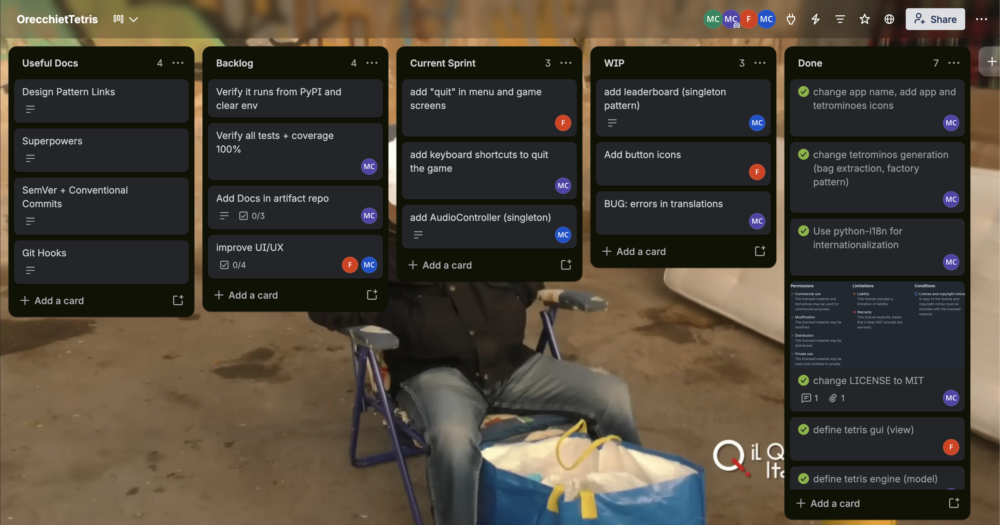

# Development

The development mostly followed the Test-Driven Development (TDD) paradigm, structured around the red-green-refactor cycle: a failing test is written first (red), the minimum code required to pass it is then implemented (green), and the resulting code is subsequently improved without altering its external behavior (refactor). This approach ensured that every feature was covered by tests from its inception and that the codebase remained continuously verifiable. Alongside this testing discipline, a structured Git branching workflow was adopted to manage collaboration and integration, based on [GitHub flow](https://docs.github.com/en/get-started/using-github/github-flow).

## DVCS

In the project, Git was used as the DVCS, with the remote repository hosted on GitHub. The branching workflow was designed to enable fast delivery of changes:

- `master` is the default branch and represents the stable version of the application.
- A `feat/` namespace precedes all the branches on which features are developed (e.g. `feat/model`, `feat/view`, etc.).
- A `fix/` namespace precedes all the branches on which bugs are fixed.
- Commit messages follow the Conventional Commits specification: `TYPE[(SCOPE)]: DESCRIPTION`.
- Each branch is modified by one, and only one, of the authors, except for changes necessary after code review by the reviewer once the Pull Request was created.

This workflow keeps `master` continuously updated with completed features, maintaining it as a single source of truth. Fast merges also reduces branch divergences and, consequently, the frequency of merge conflicts, since all the branches are "born" up to date.
For each new task (i.e. a new feature or a bug fix), a new branch was created, onto which all related commits are pushed. Once the task is complete, a Pull Request is opened for merging into `master`. Before a pull request is accepted, automatic checks are run (static analysis and tests execution), followed by a manual code review from another author. Once all checks pass and the review is approved, the pull request is merged. The merged branch is deleted to keep the Git tree clean, and deployment automations is triggered (see [CI/CD](../08-cicd/) chapter for further details).

> In rare cases, a `dev` branch was used to group several minor changes into a single branch before merging into `master`, in order to avoid triggering the deployment workflow (through GitHub Action), and the consequent version update, too frequently. In rarer cases, for hotfixes, a commit was pushed directly to `master` rather than creating a dedicated branch.

## Project Management

Project management was carried out through Trello, a web-based tool that implements the Kanban method, a visual approach to organising work in which tasks progress across a series of columns, each one representing a distinct phase of the workflow. This method proves particularly effective for keeping track of the current status of every task at a glance, as well as of the team member to whom each task has been assigned, since every card can be labelled with the name of the responsible author and moved forward only once the corresponding work has actually been completed.

The Trello board adopted for the project was structured into the following columns:

- Useful Docs: a column collecting reference material, links and documentation useful throughout the development process, rather than actual tasks to be completed.
- Backlog: tasks that have been identified and described but not yet scheduled for development.
- Current Sprint: tasks selected from the backlog to be tackled during the ongoing sprint.
- WIP (Work In Progress): tasks that a team member is actively working on at the given moment.
- Done: tasks that have been completed and verified through code review.

## Implementation details

The game operates as a standalone application, requiring no internet access whatsoever for it to function. As a direct consequence of this design choice, the implementation of any network protocol was unnecessary, given that the entire application executes on the local machine.
Since no information travels between different systems, there was likewise no reason to rely on a database for persistent storage. High scores are instead stored through a csv file, named `leaderboard.csv`, kept on the local disk. When the game is over, players can enter their name to save the result in the leaderboard.
Given the single-player nature of the application, mechanisms for authentication or authorization were deemed entirely superfluous: with only one user interacting with the system at any given time, there was no requirement to manage accounts or to assign varying levels of access privilege.

## Technological details

The whole application is written in Python. Modern type hints (used throughout and enforced by `mypy`) give static-analysis safety without leaving the language.

> The application is tested for Python versions from 3.11 to 3.14.

Kivy was chosen as the GUI framework used for the entire presentation layer: `ScreenManager`, canvas rendering of the board and pieces, keyboard input, the `Clock` game-timer and audio playback via `SoundLoader`. Kivy was chosen because it is the only library that combines GPU-accelerated canvas drawing, a native widget system and a dedicated frame clock in a single framework: its canvas redraws the grid, the ghost piece and the line-clear animations efficiently. Tkinter offers a similar Canvas widget, but it is impractical for high-frame-rate animation. Pygame handles low-level rendering and timing well, but it lacks a native widget toolkit, so menus and the leaderboard would have to be built by hand or with third-party libraries.

### Runtime Dependencies

| Library | Reason |
| ------- | --- |
| kivy | GUI, rendering, input, timer and audio |
| python-i18n | Internationalisation: UI strings are loaded from YAML locale files instead of being hard-coded, so the game can be translated |
| pyyaml | Parses the YAML locale files consumed by python-i18n |
| platformdirs | Resolves the correct per-OS user-data directory, so the leaderboard CSV is stored in the conventional location on every platform (referred to as `USER_DATA_DIR` throughout the codebase) rather than a hard-coded path |

The persistence layer needs no external library: the leaderboard is a small flat table written with Python's standard-library `csv` module.

### Development and Build Dependencies

| Tool | Role |
| ---- | ---- |
| Poetry | Dependency management, virtual-env handling and the build backend (`poetry-core`) that produces the sdist + wheel |
| pytest + pytest-cov | Test runner and coverage, chosen for `assert` introspection and fixtures (see [Validation](../05-validation/) chapter) |
| coverage | Coverage measurement and HTML report |
| mypy | Strict static type checking (see the strict `[tool.mypy]` config) |
| flake8 | Linting / style enforcement |
| poethepoet (`poe`) | Task runner defining the `test`, `coverage`, `mypy`, `flake8`, and other commands in one place |
| pre-commit | Git hooks, including the `commit-msg` hook that runs commitlint to enforce Conventional Commits |
| semantic-release + commitlint | Automated SemVer versioning, changelog, tagging and releasing (see the versioning section in [Release](../06-release/) chapter) |

The only Node.js (npm) dependencies are `semantic-release` and `commitlint`, declared in `package.json`: they belong to the JavaScript ecosystem because `semantic-release` — the de-facto standard for automated, commit-driven SemVer releasing — is an npm tool with no equivalent Python port, so it is used only in the CI/CD pipeline (not at runtime) to analyse commits, tag versions and publish releases.
