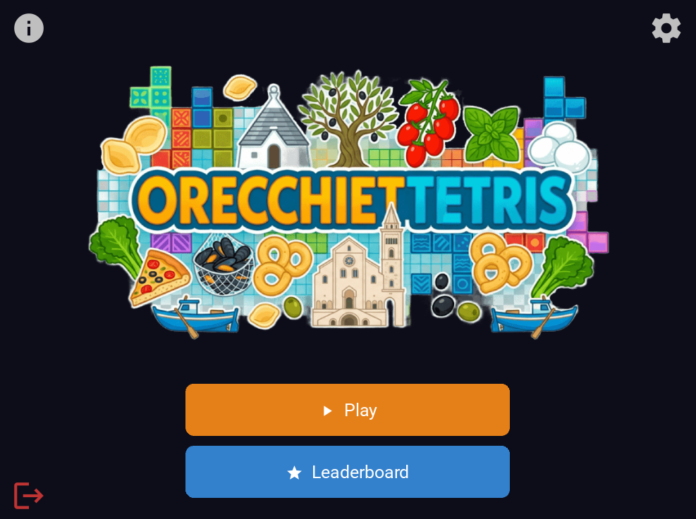
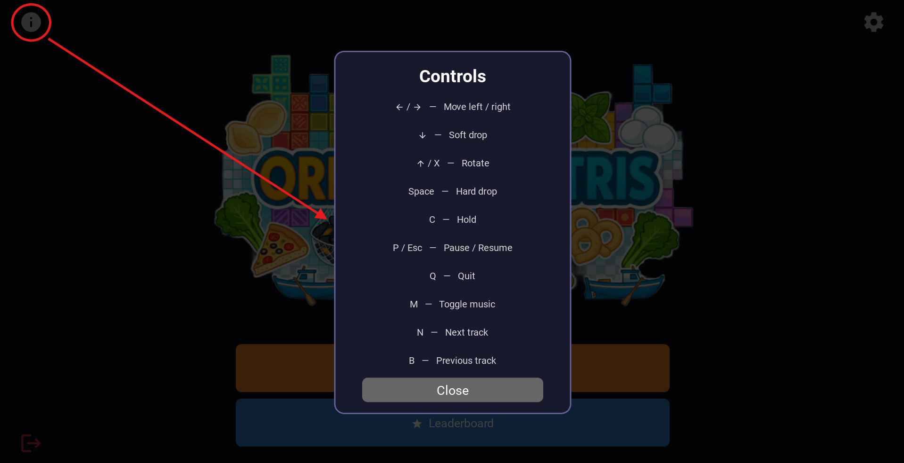
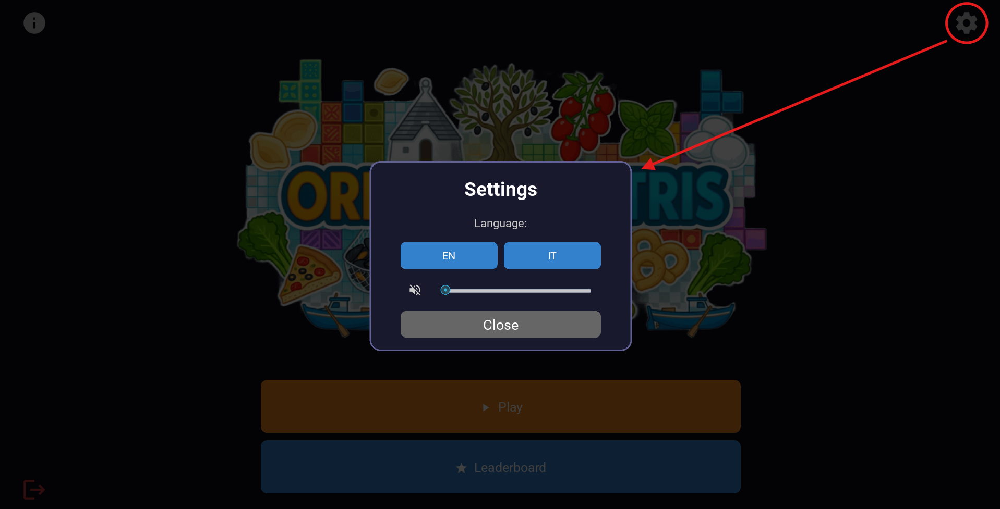
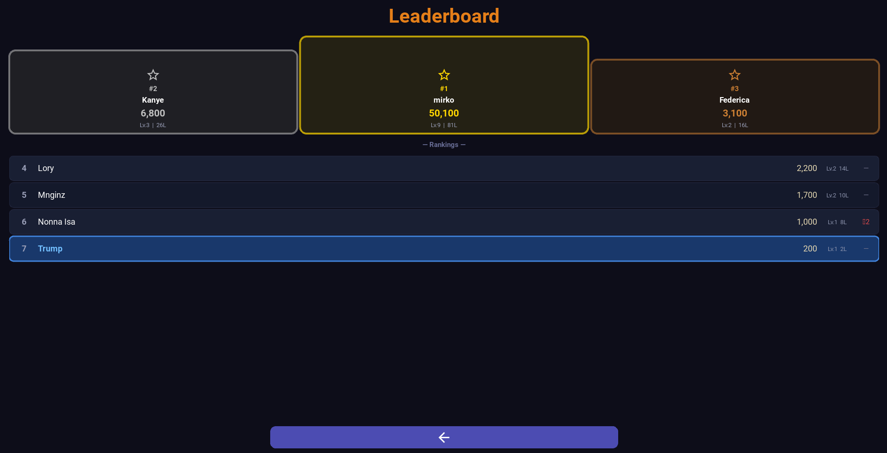
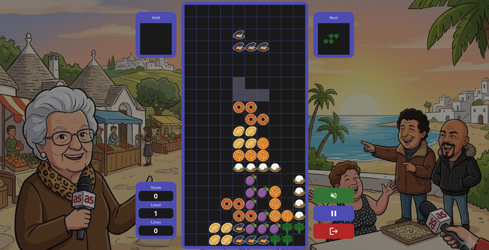
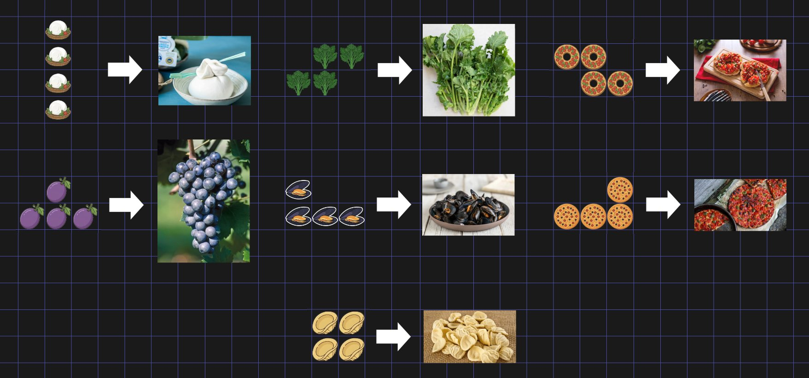
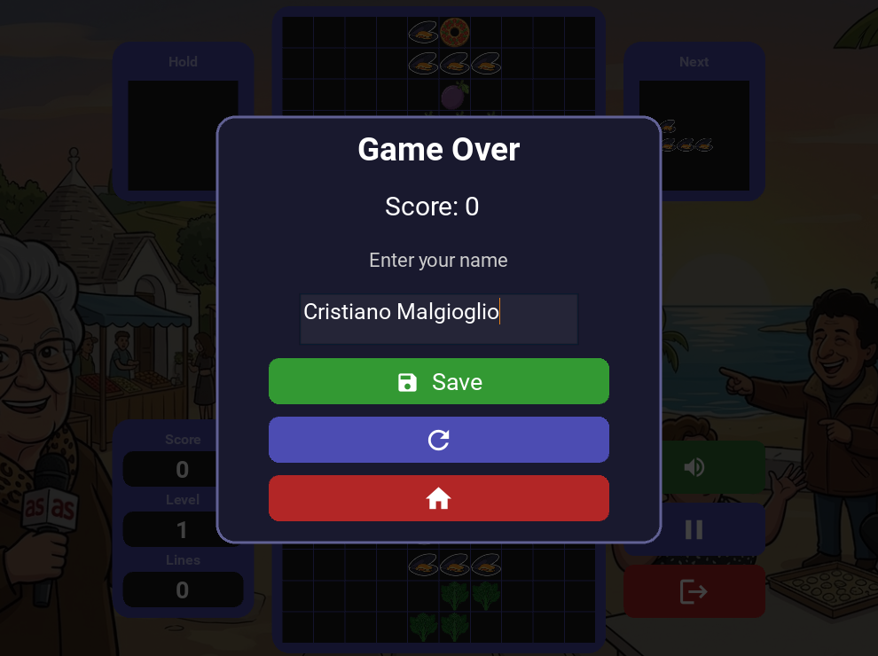

# OrecchietTetris - User Guide

Once the installation has been completed successfully, launching the command:
```bash
# Windows (cmd)
python -m OrecchietTetris 

# macOS / Linux
OrecchietTetris
```
it will bring up the main menu of the game.

## Main menu



### Info
Clicking on the "i" at the top-left corner will show the controls to use in the game.



### Settings
Clicking on the gear at the top-right corner will allow you to access settings to change the language and volume.\
The two available languages are English and Italian.\
The volume setting allows the user to set the volume and to toggle the tracklist by clicking on the volume icon. 



### Leaderboard

Clicking on the leaderboard button will open the leaderboard screen in which there will be shown the list of gamers that have saved their score.\
The top three players will be displayed at the top.\
Play and climb the rankings!



### Quit

The icon at the bottom left in the menu screen will allow you to close the application.

### Play 

Clicking on the play button will open the game screen and start a new game.

## Game



In the game screen, the three buttons located at the bottom-right corner are, respectively:
- **Volume**: Allows the player to enable or disable the game audio during gameplay.
- **Pause**: Temporarily stops the game. While the game is paused, tetrominoes stop falling and the player can resume the session at any time. When the game is resumed, a three-second countdown is displayed before gameplay continues.
- **Quit**: Exits the current game and returns to the main menu.

Other components of the game screen:
- **Hold**: Allows the player to store one tetromino for later use. The held piece can be swapped with the current one, but only once per turn.
- **Next**: Displays the upcoming tetromino, helping the player plan future moves and improve their strategy.
- **Statistics**: Shows the current game statistics including score, current level, and number of cleared lines.

### How To Play 
OrecchietTetris follows the classic Tetris gameplay mechanics. The player controls falling tetrominoes and must arrange them to complete horizontal lines on the game board.
The objective of the player is to:
- Move tetrominoes left and right to position them.
- Rotate tetrominoes to fit available spaces.
- Complete one or more horizontal lines to remove them from the board.
- Prevent the board from filling up to the top of the play area.

The game becomes progressively more challenging as the player's level increases, causing tetrominoes to fall at a faster speed.

#### In-Game keyboard controls

| Key | Action |
| --- | --- |
| ← / → | Move the tetromino left / right |
| ↓ | Soft drop the tetromino |
| ↑ or X | Rotate the tetromino clockwise |
| Space | Hard drop the tetromino |
| C | Hold the tetromino |
| P or Escape | Pause / Resume the game |
| Q | Quit the game |
| M | Toggle music |
| N | Next track |
| B | Previous track | 

#### Tetrominoes
The game includes the seven standard Tetris tetrominoes (I, O, T, S, Z, J, and L). In OrecchietTetris, these pieces are represented using traditional Apulian food icons, combining the classic mechanics of Tetris with a local cultural theme inspired by Puglia.



#### Tracklist
While playing, the player can listen to the following tracklist:

| Track | Artist | Song |
| --- | --- | --- |
| [01](assets/music/mp3/01.mp3) | Caparezza | Abiura di Me |
| [02](assets/music/mp3/02.mp3) | Serena Brancale | Baccalà |
| [03](assets/music/mp3/03.mp3) | Kid Yugi | Massafghanistan |
| [04](assets/music/mp3/04.mp3) | Sud Sound System | Le Radici Ca Tieni |
| [05](assets/music/mp3/05.mp3) | Boombadash ft. Alessandra Amoroso | Mambo Salentino |
| [06](assets/music/mp3/06.mp3) | Sal Da Vinci | Rossetto e Caffè |
| [07](assets/music/mp3/07.mp3) | Al Bano ft. Romina Power | Felicità |
| [08](assets/music/mp3/08.mp3) | Caparezza | Jodellavitanonhocapitouncazzo |
| [09](assets/music/mp3/09.mp3) | Checco Zalone | Angela |
| [10](assets/music/mp3/10.mp3) | Elvira Visone ft. Luca Sarracino | Mi Hai Rotto il Cuore |
| [11](assets/music/mp3/11.mp3) | Domenico Bini | Sta Andando Tutto Male |
| [12](assets/music/mp3/12.mp3) | Leone Di Lernia | La festa d' patron |
| [13](assets/music/mp3/13.mp3) | GemBoy | La Guerra Di Piero |

### Score and Level
Players earn points by clearing horizontal lines. The number of points awarded depends on how many lines are cleared simultaneously:
| Cleared Lines | Points |
|---------------|--------:|
| 1             | 100     |
| 2             | 300     |
| 3             | 500     |
| 4             | 800     |

The player's level increases every 10 cleared lines. As the level increases, the falling speed of the tetrominoes also increases, making the game progressively more difficult.

### Game Over
The game ends when new tetrominoes can no longer be placed on the grid because the stacked pieces have reached the top of the playing area.

At this point, the final score is displayed to the player and they can enter their name and save their final score to the local leaderboard, allowing them to compare their performance with other players.

